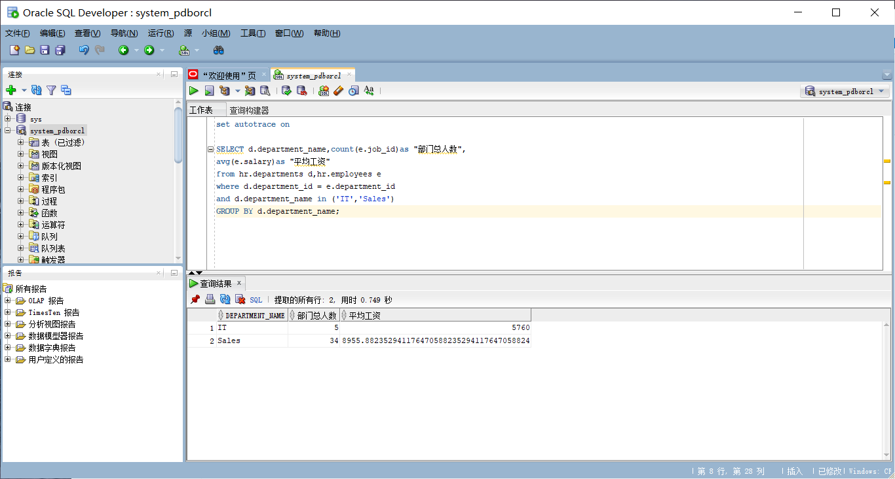
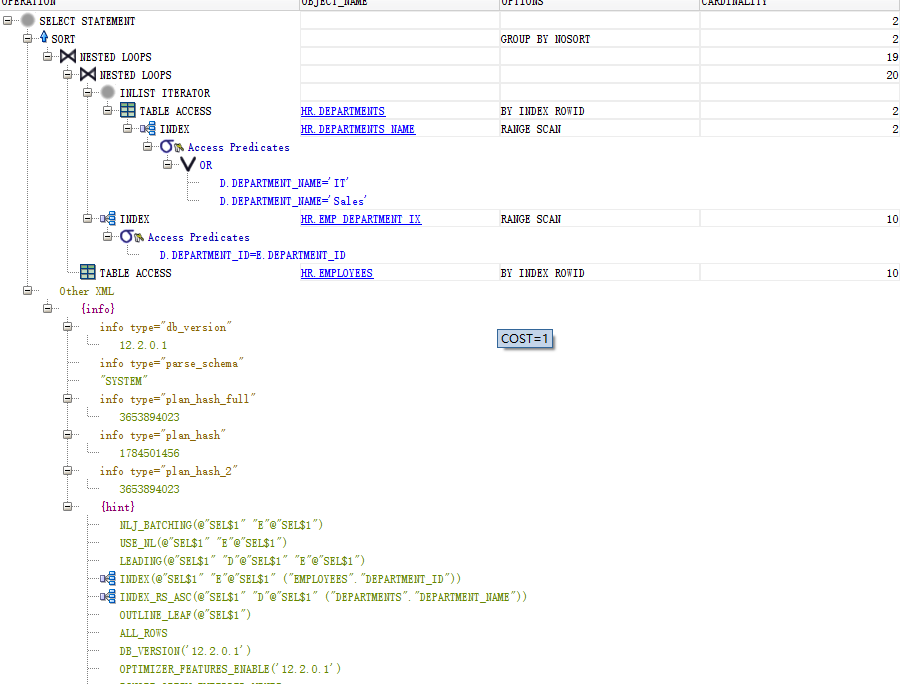
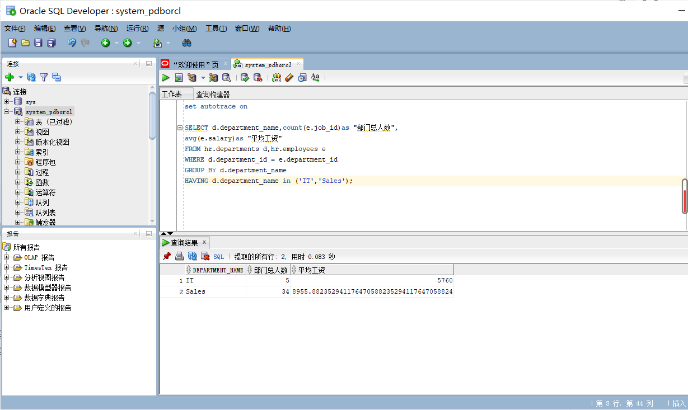
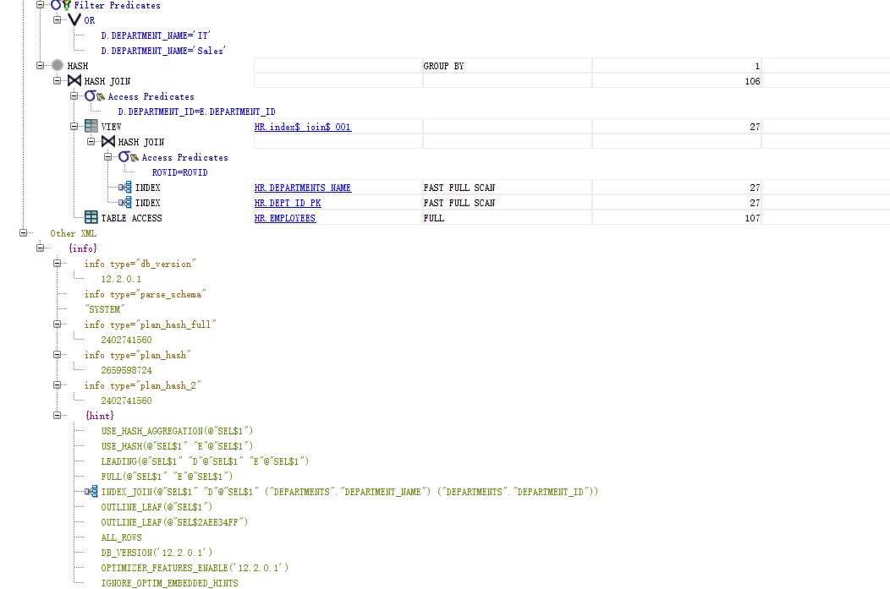
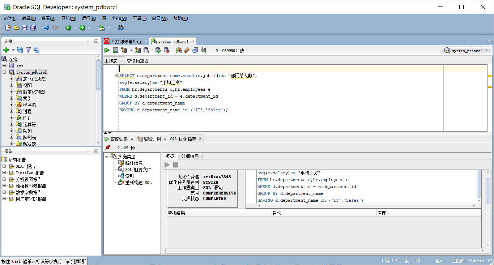
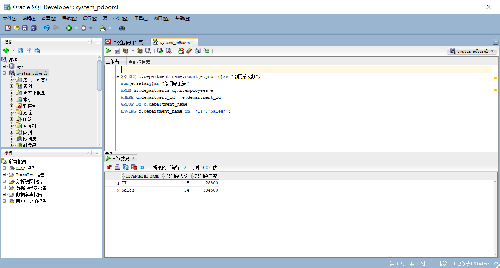
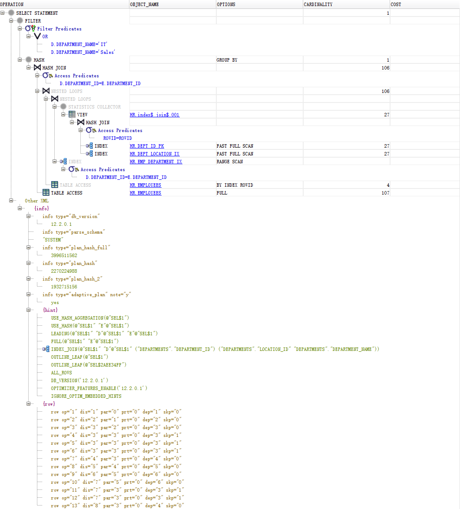
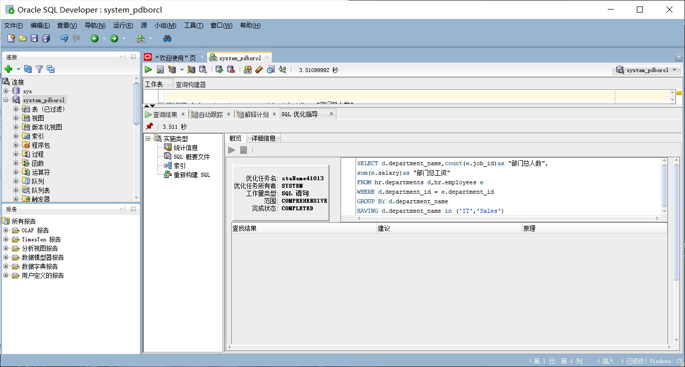

# 我的作业1
# 卓进 201810414130 一班

## 查询1
set autotrace on

SELECT d.department_name,count(e.job_id)as "部门总人数",
avg(e.salary)as "平均工资"
from hr.departments d,hr.employees e
where d.department_id = e.department_id
and d.department_name in ('IT','Sales')
GROUP BY d.department_name;

### 查询结果

### 执行计划

##查询2

set autotrace on

SELECT d.department_name,count(e.job_id)as "部门总人数",
avg(e.salary)as "平均工资"
FROM hr.departments d,hr.employees e
WHERE d.department_id = e.department_id
GROUP BY d.department_name
HAVING d.department_name in ('IT','Sales');

### 查询结果

### 执行计划

### 优化指导

## 新建查询
set autotrace on

SELECT d.department_name,count(e.job_id)as "部门总人数",
sum(e.salary)as "部门总工资"
FROM hr.departments d,hr.employees e
WHERE d.department_id = e.department_id
GROUP BY d.department_name
HAVING d.department_name in ('IT','Sales');

### 查询结果

### 执行计划

### 优化指导
