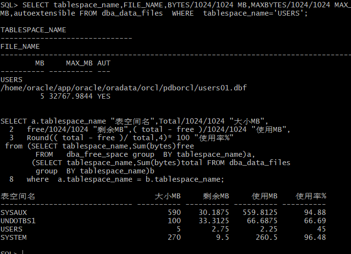
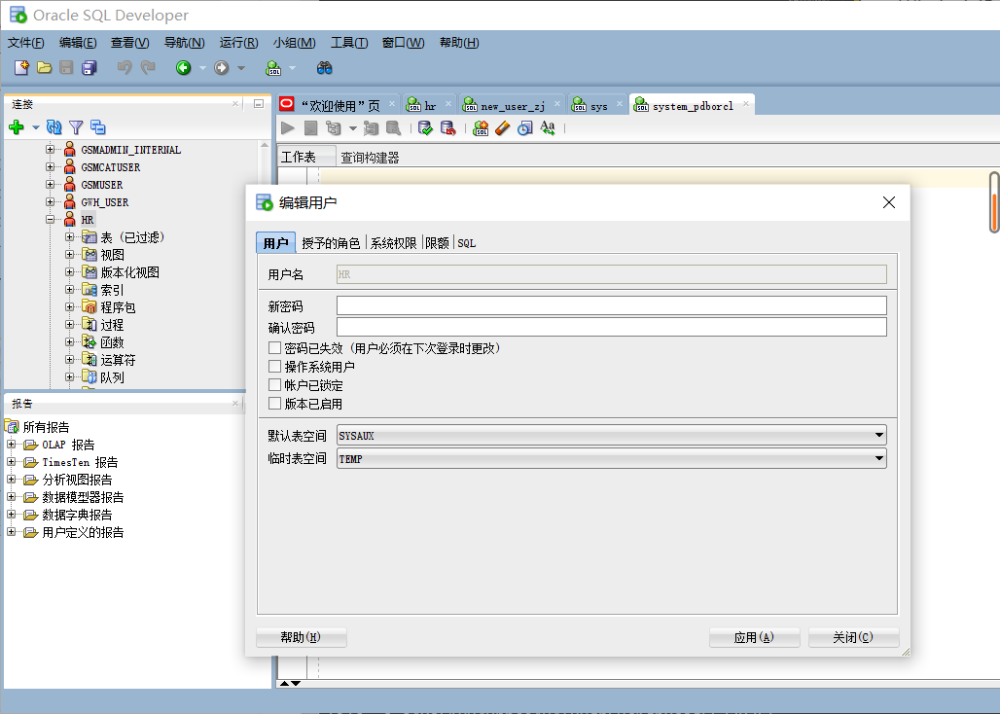
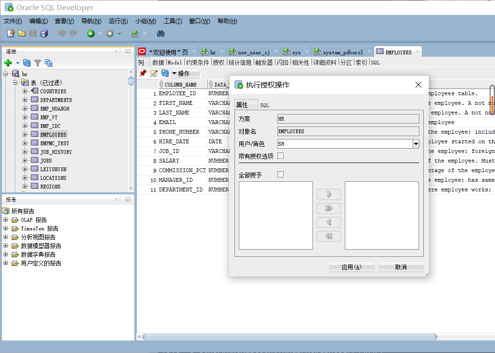

# 实验二：用户及权限管理
## 卓进 201810414130 一班

## 实验目的
掌握用户管理、角色管理、权根维护与分配的能力，掌握用户之间共享对象的操作技能。

## 实验内容
Oracle有一个开发者角色resource，可以创建表、过程、触发器等对象，但是不能创建视图。本训练要求：
- 在pdborcl插接式数据中创建一个新的本地角色con_res_view，该角色包含connect和resource角色，同时也包含CREATE VIEW权限，这样任何拥有con_res_view的用户就同时拥有这三种权限。
- 创建角色之后，再创建用户new_user，给用户分配表空间，设置限额为50M，授予con_res_view角色。
- 最后测试：用新用户new_user连接数据库、创建表，插入数据，创建视图，查询表和视图的数据。

## 实验步骤
- 第1步：以system登录到pdborcl，创建角色con_res_view和用户new_user，并授权和分配空间：
  
SQL> GRANT connect,resource,CREATE VIEW TO con_res_view_zj;

授权成功。

SQL> CREATE USER new_user_zj IDENTIFIED BY 123 DEFAULT TABLESPACE users TEMPORARY TABLESPACE temp;

用户已创建。

SQL> ALTER USER new_user_zj QUOTA 50M ON users;

用户已更改。

SQL> GRANT con_res_view_zj TO new_user_zj;

授权成功。

SQL> exit
从 Oracle Database 12c Enterprise Edition Release 12.2.0.1.0 - 64bit Production 断开

- 第2步：新用户new_user连接到pdborcl，创建表mytable和视图myview，插入数据，最后将myview的SELECT对象权限授予hr用户。

[student@deep02 ~]$ sqlplus new_user_zj/123@202.115.82.8/pdborcl

SQL*Plus: Release 12.2.0.1.0 Production on 星期二 3月 16 11:14:53 2021

Copyright (c) 1982, 2016, Oracle.  All rights reserved.

连接到:
Oracle Database 12c Enterprise Edition Release 12.2.0.1.0 - 64bit Production

SQL> show user;
USER 为 "NEW_USER_ZJ"
SQL> CREATE TABLE mytable (id number,name varchar(50));

表已创建。

SQL> INSERT INTO mytable(id,name)VALUES(1,'zhang');

已创建 1 行。

SQL> INSERT INTO mytable(id,name)VALUES (2,'wang');

已创建 1 行。

SQL> CREATE VIEW myview AS SELECT name FROM mytable;

视图已创建。

SQL>  SELECT * FROM myview;

NAME
######-------------------------------------------------- 
zhang
wang

SQL> GRANT SELECT ON myview TO hr;

授权成功。

SQL> exit
从 Oracle Database 12c Enterprise Edition Release 12.2.0.1.0 - 64bit Production 断开

 - 第3步：用户hr连接到pdborcl，查询new_user授予它的视图myview

[student@deep02 ~]$ sqlplus hr/123@202.115.82.8/pdborcl

SQL*Plus: Release 12.2.0.1.0 Production on 星期二 3月 16 11:17:36 2021

Copyright (c) 1982, 2016, Oracle.  All rights reserved.

上次成功登录时间: 星期二 3月  16 2021 11:15:30 +08:00

连接到:
Oracle Database 12c Enterprise Edition Release 12.2.0.1.0 - 64bit Production

SQL>  SELECT * FROM new_user_zj.myview;

NAME
######-------------------------------------------------- 
zhang
wang

SQL> exit
从 Oracle Database 12c Enterprise Edition Release 12.2.0.1.0 - 64bit Production 断开

## 数据库和表空间占用分析

当全班同学的实验都做完之后，数据库pdborcl中包含了每个同学的角色和用户。 所有同学的用户都使用表空间users存储表的数据。 表空间中存储了很多相同名称的表mytable和视图myview，但分别属性于不同的用户，不会引起混淆。 随着用户往表中插入数据，表空间的磁盘使用量会增加。

## 查看数据库的使用情况

- SQL-DEVELOPER修改用户的操作界面：

- sqldeveloper授权对象的操作界面：
