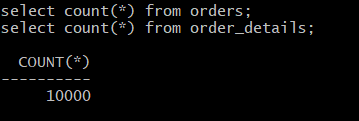

# 实验二：创建分区表
## 卓进 201810414130 一班

## 实验目的
掌握分区表的创建方法，掌握各种分区方式的使用场景。

## 实验内容

- 本实验使用3个表空间：USERS,USERS02,USERS03。在表空间中创建两张表：订单表(orders)与订单详表(order_details)。
- 使用你自己的账号创建本实验的表，表创建在上述3个分区，自定义分区策略。
- 你需要使用system用户给你自己的账号分配上述分区的使用权限。你需要使用system用户给你的用户分配可以查询执行计划的权限。
- 表创建成功后，插入数据，数据能并平均分布到各个分区。每个表的数据都应该大于1万行，对表进行联合查询。
- 写出插入数据的语句和查询数据的语句，并分析语句的执行计划。
- 进行分区与不分区的对比实验。

## 实验步骤

### 在用户ZJ中创建表：orders（订单表）

### 在用户ZJ中创建表：order_details（订单详情表）
  CREATE TABLE order_details 
  (
  id NUMBER(10, 0) NOT NULL 
  , order_id NUMBER(10, 0) NOT NULL
  , product_id VARCHAR2(40 BYTE) NOT NULL 
  , product_num NUMBER(8, 2) NOT NULL 
  , product_price NUMBER(8, 2) NOT NULL 
  , CONSTRAINT order_details_fk1 FOREIGN KEY  (order_id)
  REFERENCES orders  (  order_id   )
  ENABLE
  ) 
  TABLESPACE USERS 
  PCTFREE 10 INITRANS 1 
  STORAGE ( BUFFER_POOL DEFAULT ) 
  NOCOMPRESS NOPARALLEL
  PARTITION BY REFERENCE (order_details_fk1);

### 以用户sys创建无分区表
  CREATE TABLE ORDERS_NOSPACE 
  (
    ORDER_ID NUMBER(10, 0) NOT NULL 
  , CUSTOMER_NAME VARCHAR2(40 BYTE) NOT NULL 
  , CUSTOMER_TEL VARCHAR2(40 BYTE) NOT NULL 
  , ORDER_DATE DATE NOT NULL 
  , EMPLOYEE_ID NUMBER(6, 0) DEFAULT 0 
  , DISCOUNT NUMBER(8, 2) DEFAULT 0 
  , CONSTRAINT ORDERS_ID_ORDERS_DETAILS PRIMARY KEY 
    (
      ORDER_ID 
    )
    USING INDEX 
    (
        CREATE UNIQUE INDEX ORDERS_ID_ORDERS_DETAILS ON     ORDERS_NOSPACE (ORDER_ID ASC) 
        LOGGING 
        TABLESPACE USERS 
        PCTFREE 10 
        INITRANS 2 
        STORAGE 
        ( 
          BUFFER_POOL DEFAULT 
        ) 
        NOPARALLEL 
    )
    ENABLE 
  ) 
  LOGGING 
  TABLESPACE USERS 
  PCTFREE 10 
  INITRANS 1 
  STORAGE 
  ( 
    BUFFER_POOL DEFAULT 
  ) 
  NOCOMPRESS 
  NO INMEMORY 
  NOPARALLEL;

#建立orders_details_nospace表
  CREATE TABLE ORDER_DETAILS_NOSPACE 
  (
    ID NUMBER(10, 0) NOT NULL 
  , ORDER_ID NUMBER(10, 0) NOT NULL 
  , PRODUCT_NAME VARCHAR2(40 BYTE) NOT NULL 
  , PRODUCT_NUM NUMBER(8, 2) NOT NULL 
  , PRODUCT_PRICE NUMBER(8, 2) NOT NULL 
  ) 
  LOGGING 
  TABLESPACE USERS 
  PCTFREE 10 
  INITRANS 1 
  STORAGE 
  ( 
    INITIAL 65536 
    NEXT 1048576 
    MINEXTENTS 1 
    MAXEXTENTS UNLIMITED 
    BUFFER_POOL DEFAULT 
  ) 
  NOCOMPRESS 
  NO INMEMORY 
  NOPARALLEL;

  ALTER TABLE ORDER_DETAILS_NOSPACE
  ADD CONSTRAINT ORDERS_FOREIGN_ORDERS_DETAILS FOREIGN KEY
  (
    ORDER_ID 
  )
  REFERENCES ORDERS_NOSPACE
  (
    ORDER_ID 
  )
ENABLE;

### 计划分析

### 数据库使用情况
