# 实验六： 基于Oracle的学生管理的数据库设计
## 卓进 201810414130 一班

### 实验目的
-	任务一：自行设计一个信息系统的数据库项目，自拟某项目名称。
-	任务二：设计项目涉及的表及表空间使用方案。至少5张表和5万条数据，两个表空间。
-	任务三：设计权限及用户分配方案。至少两类角色，两个用户。
-	任务四：在数据库中建立一个程序包，在包中用PL/SQL语言设计一些存储过程和函数，实现比较复杂的业务逻辑，用模拟数据进行执行计划分析。
-	任务五：设计自动备份方案或则手工备份方案。
-	任务六：设计容灾方案。使用两台主机，通过DataGuard实现数据库整体的异地备份

### 项目背景
- 学生信息档案的管理对于学校的管理者来说至关重要，学生信息是高等学校非常重要的一项数据资源，是一个教育单位不可缺少一部分。特别是近几年来，国家政策的调整，我国高等院校大规模的扩招，给高等院校的教学管理、学生管理、后勤管理等方面都带来不少的冲击。其包含的数据量大，涉及的人员面广，而且需要及时更新，故较为复杂，难以单纯地依靠人工管理，而且传统的人工管理方式既不易于规范化，管理效率也不高，目前我国各类高等院校中还有相当一部分学生档案管理还停留在纸介质的基础上，尤其是中、小学对学生档案的管理更是落后，这样的管理机制已经不能适应时代发展的要求，其管理方法将浪费许多人力和物力。随着科学技术的不断提高，计算机科学与技术日渐成熟，计算机应用的普及已进入人类社会生活的各个领域，并发挥着越来越重要的作用。这种传统的手工管理模式必然被以计算机为物质基础的信息管理方法所取代。
作为计算机应用的一部分，使用计算机对学生档案进行管理，有着手工管理所无法比拟的优点，如：检索迅速、查找方便、可靠性高、存储量大、保密性好、寿命长、成本低等。这些优点能够极大地提高学生档案管理的效率，也是学校向科学化、正规化管理发展的必要条件，更是各个高等院校与世界接轨的重要条件。

### 开发现状
- 学生信息管理是各大学的主要日常管理工作之一，涉及到校、系、师、生的诸多方面，随着教学体制的不断改革，尤其是学分制、选课制的展开和深入，学生成绩日常管理工作及保存管理日趋繁重、复杂。迫切需要研制开发一款功能强大，操作简单，具有人性化的学生成绩管理系统。
在国外高校，与国内不同，他们一般具有较大规模的稳定的技术队伍来提供服务与技术支持。而国内高校信息化建设相对起步较晚。在数字校园理论逐步应用的过程中，各高校一方面不断投资购建各种硬件、系统软件和网络，另一方面也不断开发实施了各类教学、科研、办公管理等应用系统，形成了一定规模的信息化建设体系。但是，由于整体信息化程度相对落后，经费短缺，理论体系不健全等原因，国内高校教务管理系统在机构设置、服务范围、服务质量及人员要求上与国外高校相比都有一定的差距。
纵观目前国内研究现状，在安全性和信息更新化方面存在有一定的不足，各现有系统资料单独建立，共享性差；在以管理者为主体的方式中，信息取舍依赖管理者对于信息的认知与喜好，较不容易掌握用户真正的需求，也因此无法完全满足用户的需求。因此，教务管理软件应充分依托校园网，实现教务信息的集中管理、分散操作、信息共享，使传统的教务管理朝数字化、无纸化、智能化、综合化的方向发展，并为进一步实现完善的计算机教务管理系统和全校信息系统打下良好的基础。

### 开发工具的选择
- Oracle Database，又名Oracle RDBMS，或简称Oracle。ORACLE数据库系统是美国ORACLE公司（甲骨文）提供的以分布式数据库为核心的一组软件产品，是目前最流行的客户/服务器(CLIENT/SERVER)或B/S体系结构的数据库之一。比如SilverStream就是基于数据库的一种中间件。ORACLE数据库是目前世界上使用最为广泛的数据库管理系统，作为一个通用的数据库系统，它具有完整的数据管理功能；作为一个关系数据库，它是一个完备关系的产品；作为分布式数据库它实现了分布式处理功能。但它的所有知识，只要在一种机型上学习了ORACLE知识，便能在各种类型的机器上使用它。
Oracle数据库最新版本为Oracle Database 12c。Oracle数据库12c 引入了一个新的多承租方架构，使用该架构可轻松部署和管理数据库云。此外，一些创新特性可最大限度地提高资源使用率和灵活性，如Oracle Multitenant可快速整合多个数据库，而Automatic Data Optimization和Heat Map能以更高的密度压缩数据和对数据分层。这些独一无二的技术进步再加上在可用性、安全性和大数据支持方面的主要增强，使得Oracle数据库12c 成为私有云和公有云部署的理想平台。

### 系统概述：
- 系统主要完成以下几方面的功能：
- 用户管理：用户的注册和登录，查看自己的主页。
- 学生管理：用户登录后，系统判断其为学生用户，可以查看自己的课程信息和成绩。
- 老师管理：用户登录后，系统判断其为老师用户，可以为自己的学生添加课程，更新成绩	  和查看，修改自己和学生的信息。

### 任务一：自行设计一个信息系统的数据库项目，自拟某项目名称
- 项目名称：基于Oracle数据库的学生在校信息管理系统
- 任务二：设计项目涉及的表及表空间使用方案。至少5张表和5万条数据，两个表空间。（因为系统默认有表空间USERS）
手动创建表空间USERS02：
~~~
Create Tablespace Users02
datafile
'/home/oracle/app/oracle/oradata/orcl/pdborcl/mcdb_users02_1.dbf'
  SIZE 100M AUTOEXTEND ON NEXT 256M MAXSIZE UNLIMITED,
'/home/oracle/app/oracle/oradata/orcl/pdborcl/mcdb_users02_2.dbf'
  SIZE 100M AUTOEXTEND ON NEXT 256M MAXSIZE UNLIMITED
EXTENT MANAGEMENT LOCAL SEGMENT SPACE MANAGEMENT AUTO;
~~~
- 表结构：

|编号|字段名|数据类型|可以为空|注释|
|:---|:---|:---|:---|:---|
|1|USERNAME|VARCHAR2(10,0)|NO|用户名，主键。|
|2|USERPWD|VARCHAR2(40 BYTE)|NO|用户密码，非空|

- 代码如下：
~~~
CREATE TABLE USERS 
(
  USERNAME VARCHAR2(10 BYTE) NOT NULL 
, USERPWD VARCHAR2(10 BYTE) NOT NULL 
) 
LOGGING 
TABLESPACE USERS 
PCTFREE 10 
INITRANS 1 
STORAGE 
( 
  INITIAL 65536 
  NEXT 1048576 
  MINEXTENTS 1 
  MAXEXTENTS UNLIMITED 
  BUFFER_POOL DEFAULT 
) 
NOCOMPRESS 
NO INMEMORY 
NOPARALLEL;
插入10000条数据：
BEGIN
for i in 10000..20000 loop
Insert into users(username, userpwd) values(‘macong’, i);
end loop;
commit;
END;
~~~

- 班级表CLASS,表空间：USERS02

|编号|字段名|数据类型|可以为空|注释|
|:---|:---|:---|:---|:---|
|1|CLNO|VARCHAR2(40 BYTE)|NO|班级编号，班级表的主键|
|2|CLNAME|VARCHAR2(40 BYTE)|NO|班级名称，非空|

- 代码如下：
~~~
CREATE TABLE CLASS 
(
  CLNO VARCHAR2(10 BYTE) NOT NULL 
, CLNAME VARCHAR2(20 BYTE) NOT NULL 
) 
LOGGING 
TABLESPACE USERS02 
PCTFREE 10 
INITRANS 1 
STORAGE 
( 
  INITIAL 65536 
  NEXT 1048576 
  MINEXTENTS 1 
  MAXEXTENTS UNLIMITED 
  BUFFER_POOL DEFAULT 
) 
NOCOMPRESS 
NO INMEMORY 
NOPARALLEL;
插入10000条数据：
BEGIN
for i in 1..10000 loop
Insert into class(clno, clname) values(i, ‘17软工3班’);
end loop;
commit;
END;
~~~

- 课程表COURSE,表空间：USERS02

|编号|字段名|数据类型|可以为空|注释|
|:---|:---|:---|:---|:---|
|1|CNO|NUMBER(10,0)|NO|课程编号，课程表的主键。|
|2|CNAME|VARCHAR2(40 BYTE)|NO|班级名称，非空|
|3|CTEACHER|VARCHAR2(40 BYTE)|NO|课程老师，非空|

- 代码如下：
~~~
CREATE TABLE COURSE 
(
  CNO VARCHAR2(10 BYTE) NOT NULL 
, CNAME VARCHAR2(20 BYTE) NOT NULL 
, CTEACHER VARCHAR2(20 BYTE) NOT NULL 
) 
LOGGING 
TABLESPACE USERS02 
PCTFREE 10 
INITRANS 1 
STORAGE 
( 
  INITIAL 65536 
  NEXT 1048576 
  MINEXTENTS 1 
  MAXEXTENTS UNLIMITED 
  BUFFER_POOL DEFAULT 
) 
NOCOMPRESS 
NO INMEMORY 
NOPARALLEL;
插入10000条数据：
BEGIN
for i in 1..10000 loop
Insert into course(cno, cname, cteacher) values(i, ‘数据库’, ‘赵卫东’);
end loop;
commit;
END;
~~~

- 成绩表GRADE, 表空间：USERS02

|编号|字段名|数据类型|可以为空|注释|
|:---|:---|:---|:---|:---|
|1|STUNAME|NUMBER(10,0)|NO|学生名字|
|2|STUNO|VARCHAR2(40 BYTE)|NO|学生编号，非空|
|3|MATH|VARCHAR2(40 BYTE)|NO|数学成绩|
|4|ENGLISH|DATE|NO|英语成绩|

- 代码如下：

~~~
 CREATE TABLE GRADE 
(
  STUNAME VARCHAR2(20 BYTE) NOT NULL 
, MATH VARCHAR2(5 BYTE) 
, ENGLISH VARCHAR2(5 BYTE) 
, STUNO VARCHAR2(10 BYTE) NOT NULL 
) 
LOGGING 
TABLESPACE USERS02 
PCTFREE 10 
INITRANS 1 
STORAGE 
( 
  INITIAL 65536 
  NEXT 1048576 
  MINEXTENTS 1 
  MAXEXTENTS UNLIMITED 
  BUFFER_POOL DEFAULT 
) 
NOCOMPRESS 
NO INMEMORY 
NOPARALLEL;
插入10000条数据：
BEGIN
for i in 1..10000 loop
Insert into grade(stuno, stuname, math, english) values(i, ‘macong’, 100, 100);
end loop;
commit;
END;
~~~

- 学生表STUDENT, 表空间：USERS

|编号|字段名|数据类型|可以为空|注释|
|:---|:---|:---|:---|:---|
|1|STUNO|NUMBER(10,0)|NO|学生编号|
|2|STUNAME|VARCHAR2(10 BYTE)|NO|学生名字|
|3|QQ|VARCHAR2(40 BYTE)|NO|学生QQ号|
|4|PHONE|NUMBER(11,0)|NO|学生电话|

~~~
CREATE TABLE STUDENT 
(
  STUNO VARCHAR2(10 BYTE) NOT NULL 
, STUNAME VARCHAR2(10 BYTE) NOT NULL 
, PHONE VARCHAR2(11 BYTE) 
, QQ VARCHAR2(10 BYTE) 
) 
LOGGING 
TABLESPACE USERS 
PCTFREE 10 
INITRANS 1 
STORAGE 
( 
  INITIAL 65536 
  NEXT 1048576 
  MINEXTENTS 1 
  MAXEXTENTS UNLIMITED 
  BUFFER_POOL DEFAULT 
) 
NOCOMPRESS 
NO INMEMORY 
NOPARALLEL;
插入10000条数据：
BEGIN
for i in 1..10000 loop
Insert into student(stuno, stuname, qq, phone) values(i, ‘macong’, 442261507, 13208119341);
end loop;
commit;
END;
~~~

- 教师表TEACHER, 表空间：USERS

|编号|字段名|数据类型|可以为空|注释|
|:---|:---|:---|:---|:---|
|1|TNO|NUMBER(10,0)|NO|教师编号|
|2|TNAME|VARCHAR2(10 BYTE)|NO|教师名字|
|3|TPHONE|VARCHAR2(40 BYTE)|NO|教师电话|

~~~
CREATE TABLE TEACHER 
(
  TNO VARCHAR2(10 BYTE) NOT NULL 
, TNAME VARCHAR2(20 BYTE) NOT NULL 
, TPHONE VARCHAR2(12 BYTE) 
) 
LOGGING 
TABLESPACE USERS 
PCTFREE 10 
INITRANS 1 
STORAGE 
( 
  INITIAL 65536 
  NEXT 1048576 
  MINEXTENTS 1 
  MAXEXTENTS UNLIMITED 
  BUFFER_POOL DEFAULT 
) 
NOCOMPRESS 
NO INMEMORY 
NOPARALLEL;
插入100条数据：
BEGIN
for i in 1..100 loop
Insert into teacher(tno, tname, tphone) values(i, ‘赵卫东’, 13208119341);
end loop;
commit;
END;
~~~

### 任务三：设计权限及用户分配方案。至少两类角色，两个用户。
- 第1步：以system登录到mcdb，创建角色con_res_teachers和con_res_students和用户new_mc和new_oracle，并授权和分配空间：

~~~
$ sqlplus system/123@mvdb
SQL> CREATE ROLE con_res_teachers;
Role created.
SQL> GRANT connect,resource,CREATE VIEW TO con_res_teachers;
Grant succeeded.
SQL> CREATE USER new_oracle IDENTIFIED BY 123 DEFAULT TABLESPACE users TEMPORARY TABLESPACE temp;
User created.
SQL> ALTER USER new_oracle QUOTA 50M ON users;
User altered.
SQL> GRANT con_res_teachers TO new_oracle;
Grant succeeded.
SQL> exit

$ sqlplus system/123@mvdb
SQL> CREATE ROLE con_res_students;
Role created.
SQL> GRANT connect,resource,CREATE VIEW TO con_res_students;
Grant succeeded.
SQL> CREATE USER new_mc IDENTIFIED BY 123 DEFAULT TABLESPACE users TEMPORARY TABLESPACE temp;
User created.
SQL> ALTER USER new_mc QUOTA 50M ON users;
User altered.
SQL> GRANT con_res_students TO new_mc;
Grant succeeded.
SQL> exit

~~~

- 第2步：新用户new_oracle连接到mcdb，创建表users和视图myview，插入数据，最后将myview的SELECT对象权限授予new_oracle用户。

~~~
$ sqlplus new_mc/123@mcdb
SQL> show user;
USER is "NEW_MC"
SQL> CREATE TABLE users (username varchar(20),uesrpwd varchar(20));
Table created.
SQL> INSERT INTO users(username, userpwd)VALUES(‘macong’,10000);1 row created.
SQL> CREATE VIEW myview AS SELECT name FROM users;
View created.
SQL> SELECT * FROM users;
USERNAME--------------------------------------------------
macong
SQL> GRANT SELECT ON myview TO new_oracle;
Grant succeeded.
SQL>exit

~~~

### 任务四：在数据库中建立一个程序包，在包中用PL/SQL语言设计一些存储过程和函数，实现比较复杂的业务逻辑，用模拟数据进行执行计划分析。

- 在MyPack中创建一个函数total，查询成绩表，统计某个学生的数学和英语总分。函数total要求输入的参数是学生编号，输出学生的总分。
在MyPack中创建一个过程practice，查询某个学生的编号及其成绩。过程的输入参数是学生编号，使得该学生的数学成绩默认为优等。

- 代码如下：
~~~
create or replace PACKAGE BODY MyPack IS
  FUNCTION Get_total(V_DEPARTMENT_ID NUMBER) RETURN NUMBER
  AS
       a number(20,2);
       b number(20,2);
  BEGIN

       SELECT MATH,ENGLISH into a,b from GRADE where STUNO=V_DEPARTMENT_ID; 
       RETURN sum(a,b);
    END;
  PROCEDURE practice(V_EMPLOYEE_ID NUMBER)
  AS
    maths number(10);
     begin
        update GRADE set MATH='85'  where STUNO=V_EMPLOYEE_ID;
    END;
END MyPack;

~~~
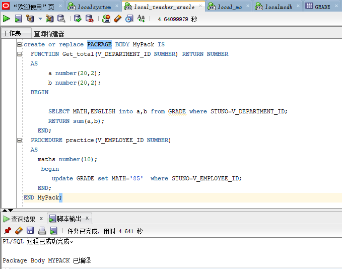

### 任务五：设计自动备份方案或则手工备份方案。

- 开始全备份：

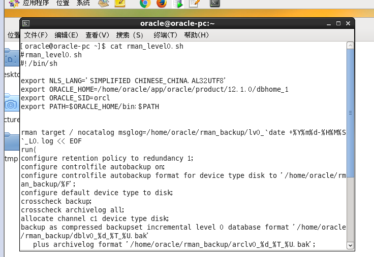
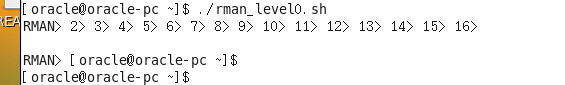

- 每天定时开始增量备份：

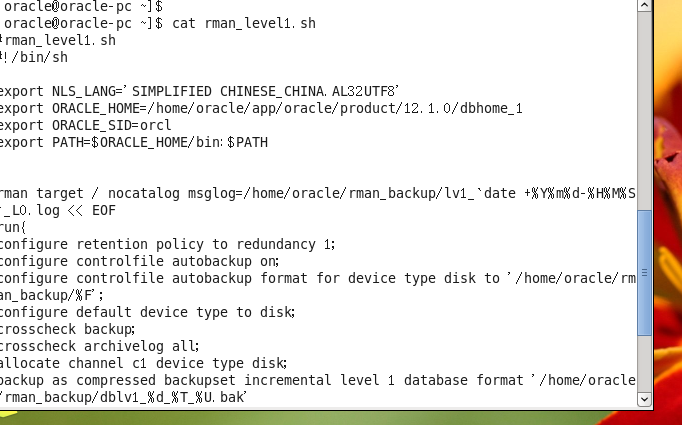
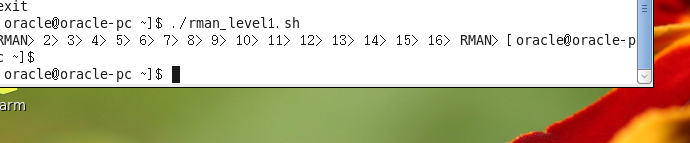

- 查看备份文件

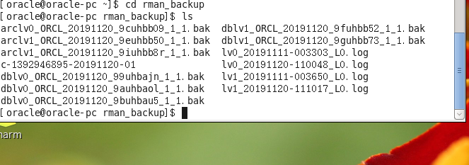
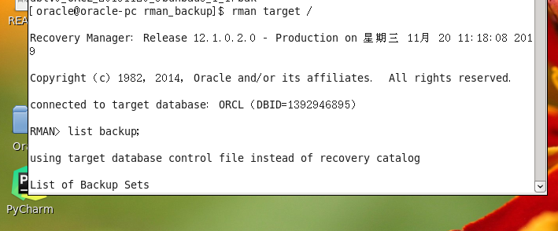
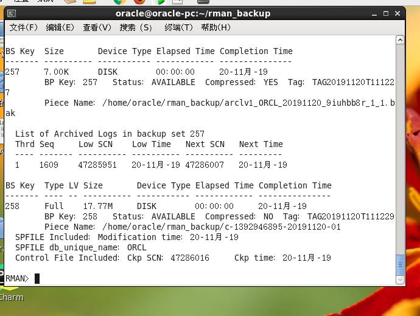

- 备份后修改数据：

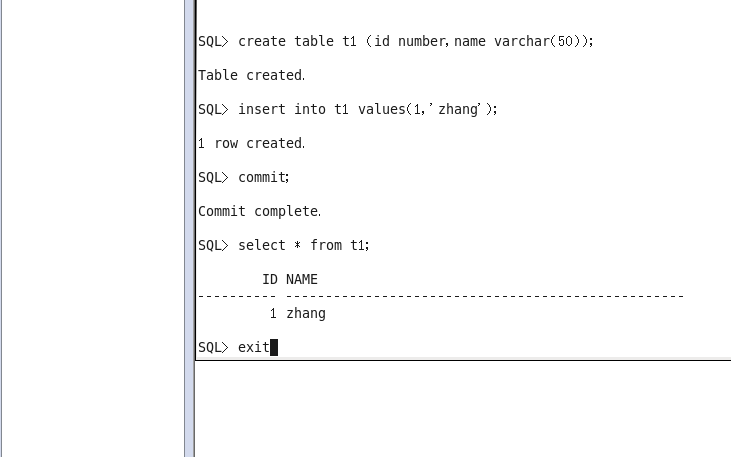

- 删除数据库文件，模拟数据库文件损坏:

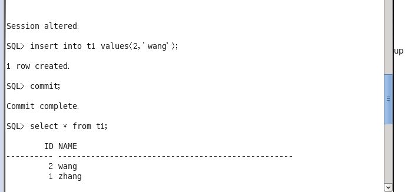
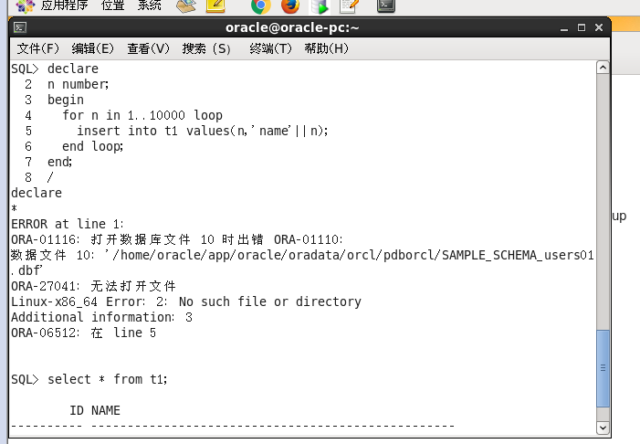
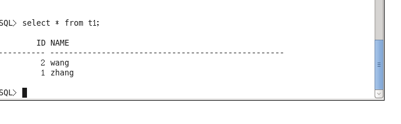

- 数据库完全恢复：（重启损坏的数据库到mount状态）

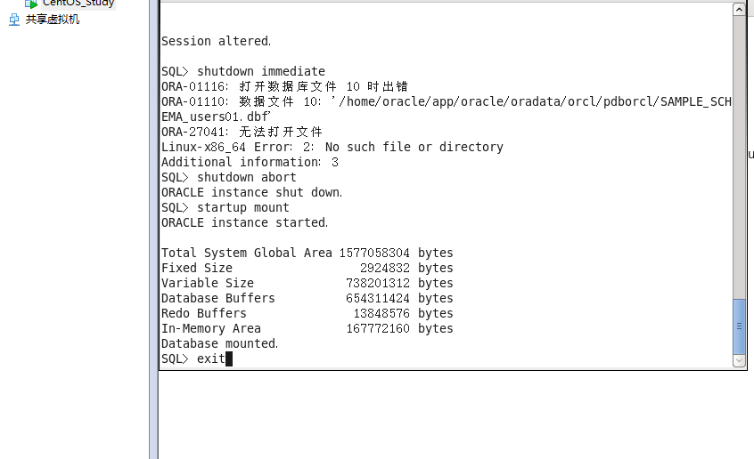

- 开始恢复数据库：

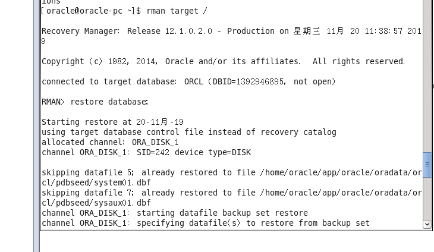
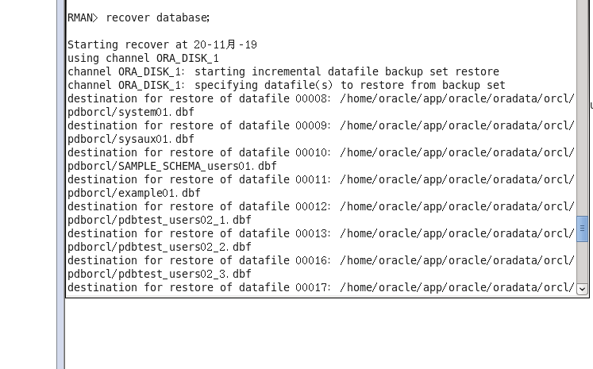
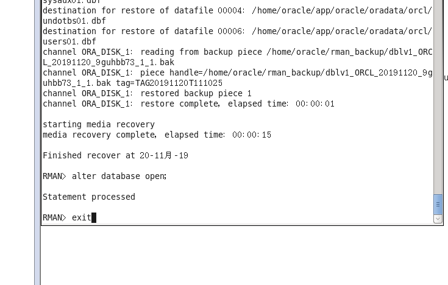

- 查询数据是否恢复：

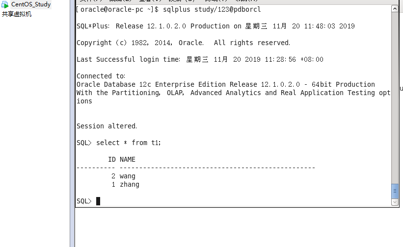

- 删除备份集：

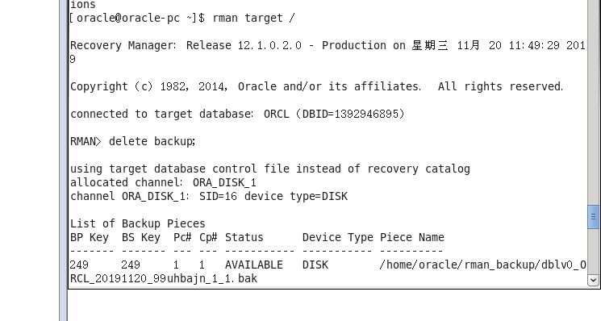

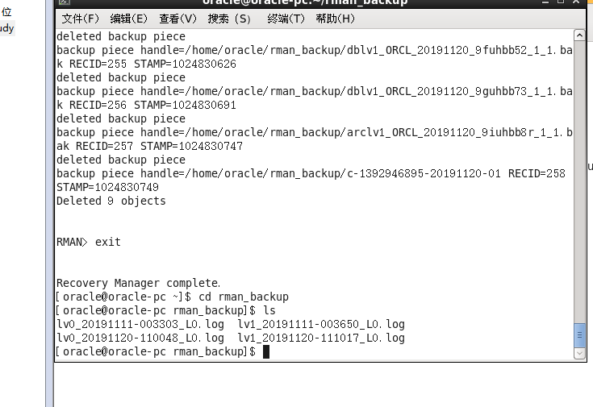

### 实验总结与体会

通过最后的期末实验，让我知道了在Oracle方面还有很长的路要走。oracle的体系很庞大，要学习它，首先要了解oracle的框架。　　
### 1、物理结构（由控制文件、数据文件、重做日志文件、参数文件、归档文件、密码文件组成）
- 控制文件：包含维护和验证数据库完整性的必要信息、例如，控制文件用于识别数据文件和重做日志文件，一个数据库至少需要一个控制文件
- 数据文件：存储数据的文件
- 重做日志文件：含对数据库所做的更改记录，这样万一出现故障可以启用数据恢复。一个数据库至少需要两个重做日志文件
- 参数文件：定义Oracle 例程的特性，例如它包含调整SGA 中一些内存结构大小的参数
- 归档文件：是重做日志文件的脱机副本，这些副本可能对于从介质失败中进行恢复很必要。
- 密码文件：认证哪些用户有权限启动和关闭Oracle例程
　　
### 2、逻辑结构（表空间、段、区、块）
- 表空间：是数据库中的基本逻辑结构，一系列数据文件的集合。
- 段：是对象在数据库中占用的空间
- 区：是为数据一次性预留的一个较大的存储空间
- 块：ORACLE最基本的存储单位，在建立数据库的时候指定
　　
### 3、内存分配（SGA和PGA）
- SGA：是用于存储数据库信息的内存区，该信息为数据库进程所共享。它包含Oracle 服务器的数据和控制信息, 它是在Oracle 服务器所驻留的计算机的实际内存中得以分配，如果实际内存不够再往虚拟内存中写。
- PGA：包含单个服务器进程或单个后台进程的数据和控制信息，与几个进程共享的SGA 正相反PGA 是只被一个进程使用的区域，PGA 在创建进程时分配在终止进程时回收
　　
### 4、后台进程（数据写进程、日志写进程、系统监控、进程监控、检查点进程、归档进程、服务进程、用户进程）
- 数据写进程：负责将更改的数据从数据库缓冲区高速缓存写入数据文件
- 日志写进程：将重做日志缓冲区中的更改写入在线重做日志文件
- 系统监控：检查数据库的一致性如有必要还会在数据库打开时启动数据库的恢复
- 进程监控：负责在一个Oracle 进程失败时清理资源
- 检查点进程：负责在每当缓冲区高速缓存中的更改永久地记录在数据库中时,更新控制文件和数据文件中的数据库状态信息。
- 归档进程：在每次日志切换时把已满的日志组进行备份或归档
- 服务进程：用户进程服务。
- 用户进程：在客户端，负责将用户的SQL 语句传递给服务进程，并从服务器段拿回查询数据。
　　
### 5、oracle例程：Oracle 例程由SGA 内存结构和用于管理数据库的后台进程组成。例程一次只能打开和使用一个数据库。
　　
### 6、SCN(System Change Number)：系统改变号，一个由系统内部维护的序列号。当系统需要更新的时候自动增加，他是系统中维持数据的一致性和顺序恢复的重要标志。
### 通过一学期的学习，我发现对上述体系的了解还是不够，希望以后通过查资料，问老师等途径，能将上述的知识点都一一掌握。